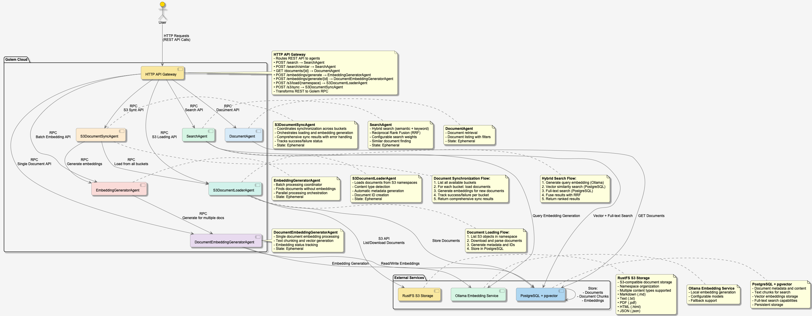

# Golem RAG System (Rust Implementation)

A comprehensive Retrieval-Augmented Generation (RAG) system built on Golem Cloud v1.4.2, featuring hybrid search capabilities, document management, and embedding generation.

## Features

- **Hybrid Search**: Combines semantic (vector embeddings) and keyword (full-text) search using Reciprocal Rank Fusion (RRF)
- **Document Management**: Store, retrieve, and manage documents with metadata
- **Embedding Generation**: Automatic vector embeddings for documents with multiple provider support
- **S3 Integration**: Load documents from multiple S3 buckets with namespace organization
- **RESTful API**: HTTP endpoints for all operations
- **PostgreSQL Backend**: Persistent storage with vector search capabilities (pgvector)

## Available Agents

### SearchAgent
The core search agent providing multiple search strategies:

**Methods:**
- `find_similar_documents(document_id, limit?)` - Find similar documents by ID
- `search(query, filters?, limit?, threshold?, config?)` - Search combining semantic and/or keyword search

**Search Features:**
- Configurable semantic vs keyword weights
- Reciprocal Rank Fusion (RRF) for result combination
- Match type detection (semantic-only, keyword-only, or both)
- Support for all existing metadata filters
- **Pure semantic search**: Set `enable_keyword = false` in config
- **Pure keyword search**: Set `enable_semantic = false` in config

### DocumentAgent
Document storage and retrieval management:

**Methods:**
- `get_document(document_id)` - Retrieve complete document
- `get_document_metadata(document_id)` - Get document metadata only
- `list_documents(filters?, limit?)` - List documents with optional filtering

### EmbeddingGeneratorAgent
High-level batch processing coordinator for embeddings:

**Methods:**
- `generate_embeddings_for_documents(document_ids)` - Generate embeddings for multiple documents in parallel
- `generate_embeddings_for_all_documents()` - Find and process all documents without embeddings

### DocumentEmbeddingGeneratorAgent  
Individual document embedding processor:

**Methods:**
- `generate_embeddings_for_document(document_id)` - Generate embeddings for a single document
- `remove_embeddings_for_document(document_id)` - Remove all embeddings for a document
- `get_embedding_status(document_id)` - Check embedding generation status

### S3DocumentLoaderAgent
S3 integration for document loading:

**Methods:**
- `load_documents(bucket, prefix?)` - Load documents from S3 bucket with optional prefix
- `list_documents(bucket, prefix?)` - List available documents in bucket with optional prefix
- `list_buckets()` - List all available S3 buckets

**Note**: Uses `bucket` and optional `prefix` parameters for flexible S3 path filtering. The namespace is automatically extracted from the actual S3 key path structure (e.g., "legal/contracts/file.pdf" → namespace: "legal/contracts"). Supports any prefix-based filtering for maximum flexibility.

### S3DocumentSyncAgent
S3 document synchronization and processing coordinator:

**Methods:**
- `sync_all()` - Synchronize all buckets by loading documents and generating embeddings

**Features:**
- Coordinates document loading across all S3 buckets
- Automatically generates embeddings for newly loaded documents
- Provides comprehensive sync results with success/failure tracking
- Handles errors gracefully and continues processing other buckets
- Returns detailed statistics on documents loaded and embeddings generated

## Architecture



The system consists of 6 core agents running on Golem Cloud, coordinated through an HTTP API Gateway and backed by PostgreSQL with pgvector for persistent storage:

### Core Components

**API Gateway**
- Routes REST API requests to appropriate agents
- Transforms HTTP to Golem RPC calls
- Provides unified interface for all operations

**SearchAgent**
- Hybrid search combining semantic (vector) and keyword (full-text) search
- Reciprocal Rank Fusion (RRF) for result combination
- Configurable search weights and thresholds
- Similar document finding capabilities

**DocumentAgent**
- Document retrieval operations
- Metadata handling with filtering support
- Document listing and search operations

**EmbeddingGeneratorAgent**
- Batch processing coordinator for multiple documents
- Finds and processes documents without embeddings
- Parallel processing orchestration

**DocumentEmbeddingGeneratorAgent**
- Single document embedding processing
- Text chunking and vector generation
- Embedding status tracking and management

**S3DocumentLoaderAgent**
- Document loading from multiple S3 buckets with flexible prefix-based filtering
- Content type detection (md, txt, pdf, html, json)
- Automatic metadata generation and document ID creation
- Bucket-specific document management
- Automatic namespace extraction from S3 key paths

**S3DocumentSyncAgent**
- Coordinates synchronization across all S3 buckets
- Orchestrates document loading and embedding generation
- Provides comprehensive sync results with error handling
- Tracks success/failure status for each bucket
- Returns detailed statistics on processing results

### Data Flow

1. **Document Synchronization**: S3DocumentSyncAgent → S3DocumentLoaderAgent → EmbeddingGeneratorAgent → PostgreSQL
2. **Document Ingestion**: S3 (multiple buckets) → S3DocumentLoaderAgent → PostgreSQL
3. **Embedding Generation**: EmbeddingGeneratorAgent → DocumentEmbeddingGeneratorAgent → Ollama → PostgreSQL
4. **Search Operations**: API Gateway → SearchAgent → PostgreSQL (vector + full-text) → Results

### External Services

- **PostgreSQL + pgvector**: Persistent storage for documents, chunks, and vector embeddings
- **RustFS S3 Storage**: S3-compatible document storage with multi-bucket support and namespace organization
- **Ollama**: Local embedding generation service with configurable models

## Quick Start

### Prerequisites

- Rust with `wasm32-wasip1` target: `rustup target add wasm32-wasip1`
- `cargo-component` version 0.21.1: `cargo install --force cargo-component@0.21.1`
- Golem CLI (`golem`) v1.4.2: download from https://github.com/golemcloud/golem/releases
- Docker and Docker Compose
- S3 buckets (optional, for document loading)

### Environment Setup

Copy `.env.example` to `.env` and configure if needed.

### Infrastructure Setup

Start the complete infrastructure using Docker Compose:

```bash
# Start all services (database, storage, and embeddings)
docker-compose up -d

# This includes:
# - PostgreSQL with pgvector extension and automatic migrations
# - RustFS S3-compatible storage with multi-bucket support
# - Ollama for local embedding generation
# - Automatic setup of multiple buckets and embedding models
```

### Loading Documents

#### 1. Via Local Files to PostgreSQL
Load documents from local files directly to the PostgreSQL database:
```bash
./load_to_postgres.sh data/
```

#### 2. Via S3 (RustFS) - Flexible Prefix Support
Load documents from S3-compatible storage using flexible prefix-based filtering:

**Step A: Upload documents to specific bucket**
```bash
# Usage: ./upload_to_s3.sh [bucket] [data_directory]
./upload_to_s3.sh golem-documents data general
```

**Step B: List files in bucket**
```bash
# Usage: ./list_s3_files.sh [bucket]
./list_s3_files.sh golem-documents
```

**Step C: Trigger document loading in the agent**
```bash
# With prefix
golem agent invoke 's3-document-loader-agent()' \
  'golem-rust:rag/s3-document-loader-agent.{load-documents}' \
  '"golem-documents"' '"general/"'

# Without prefix (load all documents)
golem agent invoke 's3-document-loader-agent()' \
  'golem-rust:rag/s3-document-loader-agent.{load-documents}' \
  '"golem-documents"' '""'
```

**Features:**
- **Flexible prefix support**: Filter by any S3 prefix (e.g., "legal/", "contracts/2024/")
- **Multi-bucket support**: Organize documents across different buckets
- **Automatic content type detection** (md, txt, pdf, html, json)
- **Document ID generation using MD5 hash**
- **Metadata creation with timestamps**
- **Automatic namespace extraction** from S3 key paths
- **Bucket-specific document management and isolation**
- **Robust XML parsing** for S3 metadata extraction

### Building and Running

```bash
# Build all components
golem build

# Deploy locally
golem deploy golem.yaml

# Test the API (search)
curl -X POST http://localhost:9006/search \
  -H "Content-Type: application/json" \
  -d '{"query": "quantum computing", "limit": 5}'
```

### Agent Invocation Examples

#### DocumentEmbeddingGeneratorAgent
```bash
# Generate embeddings for a specific document
golem agent invoke 'document-embedding-generator-agent()' \
  'golem-rust:rag/document-embedding-generator-agent.{generate-embeddings-for-document}' \
  '"doc_123"'

# Remove embeddings for a document
golem agent invoke 'document-embedding-generator-agent()' \
  'golem-rust:rag/document-embedding-generator-agent.{remove-embeddings-for-document}' \
  '"doc_123"'

# Get embedding status for a document
golem agent invoke 'document-embedding-generator-agent()' \
  'golem-rust:rag/document-embedding-generator-agent.{get-embedding-status}' \
  '"doc_123"'
```

#### EmbeddingGeneratorAgent
```bash
# Generate embeddings for multiple documents
golem agent invoke 'embedding-generator-agent()' \
  'golem-rust:rag/embedding-generator-agent.{generate-embeddings-for-documents}' \
  '["doc_123", "doc_456", "doc_789"]'

# Generate embeddings for all documents without embeddings
golem agent invoke 'embedding-generator-agent()' \
  'golem-rust:rag/embedding-generator-agent.{generate-embeddings-for-all-documents}'
```

#### S3DocumentSyncAgent
```bash
# Synchronize all buckets (load documents and generate embeddings)
golem agent invoke 's3-document-sync-agent()' \
  'golem-rust:rag/s3-document-sync-agent.{sync-all}'
```

## API Endpoints

### Search Operations

```bash
# Search (primary search method)
POST /search
{
  "query": "artificial intelligence ethics",
  "filters": {
    "content_types": ["Text", "Markdown"]
  },
  "limit": 10,
  "threshold": 0.7,
  "config": {
    "semantic_weight": 0.7,
    "keyword_weight": 0.3,
    "enable_semantic": true,
    "enable_keyword": true
  }
}

# Pure semantic search (using search with keyword disabled)
POST /search
{
  "query": "machine learning algorithms",
  "limit": 10,
  "threshold": 0.7,
  "config": {
    "enable_keyword": false,
    "enable_semantic": true
  }
}

# Semantic search with filters (using search)
POST /search
{
  "query": "sustainable development",
  "filters": {
    "content_types": ["Markdown"],
    "tags": ["environment", "climate"],
    "sources": ["research_papers"]
  },
  "limit": 5,
  "threshold": 0.8,
  "config": {
    "enable_keyword": false,
    "enable_semantic": true
  }
}

# Find similar documents
POST /search/similar
{
  "document_id": "doc_123",
  "limit": 5
}
```

### Document Management

```bash
# Get document
GET /documents/{document_id}

# Generate embeddings
POST /embeddings/generate/{document_id}

# Check embedding status
GET /embeddings/status/{document_id}
```

### S3 Document Management

```bash
# Load documents from S3 bucket with optional prefix
POST /s3/load/{bucket}
{
  "prefix": "general/"  // optional
}

# List documents in S3 bucket with optional prefix
POST /s3/list/{bucket}
{
  "prefix": "general/"  // optional
}

# List all S3 buckets
GET /s3/buckets

# Synchronize all buckets (load documents and generate embeddings)
POST /s3/sync
```

**Example: Load from golem-documents bucket with legal prefix**
```bash
POST /s3/load/golem-documents
{
  "prefix": "general/"
}
```

**Example: Synchronize all buckets**
```bash
POST /s3/sync
```

## Hybrid Search Configuration

The hybrid search combines semantic and keyword search results using Reciprocal Rank Fusion (RRF):

```rust
HybridSearchConfig {
    semantic_weight: 0.7,    // Weight for semantic search results
    keyword_weight: 0.3,     // Weight for keyword search results  
    rrf_k: 60.0,            // RRF parameter (higher = more rank fusion)
    enable_semantic: true,   // Enable/disable semantic search
    enable_keyword: true,   // Enable/disable keyword search
}
```

### Search Result Types

- **SemanticOnly**: Found only through vector similarity
- **KeywordOnly**: Found only through full-text search
- **BothMatch**: Found by both search methods (highest relevance)

## Data Models

### Document
```rust
Document {
    id: String,
    title: String,
    content: String,
    source: String,
    namespace: String,
    tags: Vec<String>,
    metadata: DocumentMetadata,
    // ... other fields
}
```

### Hybrid Search Result
```rust
HybridSearchResult {
    chunk: DocumentChunk,
    semantic_score: f32,
    keyword_score: f32,
    combined_score: f32,
    match_type: MatchType,
    relevance_explanation: Option<String>,
}
```

## Database Schema

The system uses PostgreSQL with the following key tables:

- `documents` - Document metadata and content
- `document_chunks` - Text chunks for search
- `document_embeddings` - Vector embeddings (pgvector)

## Security Considerations

- Environment variables for sensitive configuration
- Database connection pooling
- S3 access through IAM roles when possible
- API rate limiting (configure in golem.yaml)

## Development

```bash
# Run clippy and fmt
cargo clippy --all-targets --all-features -- -D warnings
cargo fmt --all

# Run tests
cargo test

# Build all components (recommended)
golem build
```

## Contributing

1. Fork the repository
2. Create a feature branch
3. Make your changes
4. Run tests and linting
5. Submit a pull request

---

Built with Golem Cloud and Rust
