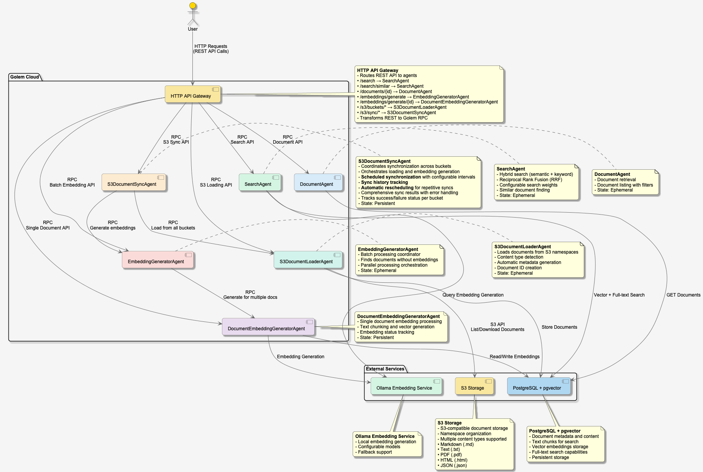

# Golem RAG System (Rust Implementation)

A comprehensive Retrieval-Augmented Generation (RAG) system built on Golem Cloud v1.5.4, featuring hybrid search capabilities, document management, and embedding generation.

## Features

- **Hybrid Search**: Combines semantic (vector embeddings) and keyword (full-text) search using Reciprocal Rank Fusion (RRF)
- **Document Management**: Store, retrieve, and manage documents with metadata
- **Embedding Generation**: Automatic vector embeddings for documents with multiple provider support
- **S3 Integration**: Load documents from multiple S3 buckets with namespace organization
- **RESTful API**: HTTP endpoints for all operations
- **PostgreSQL Backend**: Persistent storage with vector search capabilities (pgvector)


## Architecture



The system consists of 6 core agents running on Golem Cloud, coordinated through an HTTP API Gateway and backed by PostgreSQL with pgvector for persistent storage:

### Core Components

**API Gateway**
- Routes REST API requests to appropriate agents
- Transforms HTTP to Golem RPC calls
- Provides unified interface for all operations

**SearchAgent**
- Hybrid search combining semantic (vector) and keyword (full-text) search
- Reciprocal Rank Fusion (RRF) for result combination
- Configurable search weights and thresholds
- Similar document finding capabilities

**DocumentAgent**
- Document retrieval operations
- Metadata handling with filtering support
- Document listing and search operations

**EmbeddingGeneratorAgent**
- Batch processing coordinator for multiple documents
- Finds and processes documents without embeddings
- Parallel processing orchestration

**DocumentEmbeddingGeneratorAgent**
- Single document embedding processing
- Text chunking and vector generation
- Embedding status tracking and management

**S3DocumentLoaderAgent**
- Document loading from multiple S3 buckets with flexible prefix-based filtering
- Content type detection (md, txt, pdf, html, json)
- Automatic metadata generation and document ID creation
- Bucket-specific document management
- Automatic namespace extraction from S3 key paths

**S3DocumentSyncAgent**
- Coordinates synchronization across all S3 buckets
- Orchestrates document loading and embedding generation
- **Scheduled synchronization** with configurable intervals and automatic rescheduling
- **Sync history management** with detailed tracking of past operations
- Provides comprehensive sync results with error handling
- Tracks success/failure status for each bucket
- Returns detailed statistics on processing results
- Maintains persistent sync state across agent restarts

### Data Flow

1. **Document Synchronization**: S3DocumentSyncAgent → S3DocumentLoaderAgent → EmbeddingGeneratorAgent → PostgreSQL
2. **Document Ingestion**: S3 (multiple buckets) → S3DocumentLoaderAgent → PostgreSQL
3. **Embedding Generation**: EmbeddingGeneratorAgent → DocumentEmbeddingGeneratorAgent → Ollama → PostgreSQL
4. **Search Operations**: API Gateway → SearchAgent → PostgreSQL (vector + full-text) → Results

### External Services

- **PostgreSQL + pgvector**: Persistent storage for documents, chunks, and vector embeddings
- **S3 Storage**: S3-compatible document storage with multi-bucket support and namespace organization
- **Ollama**: Local embedding generation service with configurable models

## Quick Start

### Prerequisites

- Rust with `wasm32-wasip2` target: `rustup target add wasm32-wasip2`
- `cargo-component` version 0.21.1: `cargo install --force cargo-component@0.21.1`
- Golem CLI (`golem`) v1.5.4: download from https://github.com/golemcloud/golem/releases
- Docker and Docker Compose
- S3 buckets (optional, for document loading)

### Environment Setup

Copy `.env.example` to `.env` and configure if needed.

### Infrastructure Setup

Start the complete infrastructure using Docker Compose:

```bash
# Start all services (database, storage, and embeddings)
docker-compose up -d

# This includes:
# - PostgreSQL with pgvector extension and automatic migrations
# - RustFS S3-compatible storage with multi-bucket support
# - Ollama for local embedding generation
# - Automatic setup of multiple buckets and embedding models
```

### Loading Documents

#### 1. Via Local Files to PostgreSQL
Load documents from local files directly to the PostgreSQL database:
```bash
./load_to_postgres.sh data/
```

#### 2. Via S3 - Flexible Prefix Support
Load documents from S3-compatible storage using flexible prefix-based filtering:

**Step A: Upload documents to specific bucket**
```bash
# Usage: ./upload_to_s3.sh [bucket] [data_directory]
./upload_to_s3.sh golem-documents data general
```

**Step B: List files in bucket**
```bash
# Usage: ./list_s3_files.sh [bucket]
./list_s3_files.sh golem-documents
```

**Step C: Trigger document loading in the agent**
```bash
# With prefix
golem agent invoke 'S3DocumentLoaderAgent()' load_documents '"golem-documents"' 'Some("general/")'

# Without prefix (load all documents)
golem agent invoke 'S3DocumentLoaderAgent()' load_documents '"golem-documents"' 'None'
```

**Features:**
- **Flexible prefix support**: Filter by any S3 prefix (e.g., "legal/", "contracts/2024/")
- **Multi-bucket support**: Organize documents across different buckets
- **Automatic content type detection** (md, txt, pdf, html, json)
- **Document ID generation using MD5 hash**
- **Metadata creation with timestamps**
- **Automatic namespace extraction** from S3 key paths
- **Bucket-specific document management and isolation**
- **Robust XML parsing** for S3 metadata extraction

### Building and Running

```bash
# Build all components
golem build

# Deploy locally
golem deploy --yes

# Test the API (search)
curl -X POST http://localhost:9006/search \
  -H "Content-Type: application/json" \
  -d '{"query": "quantum computing", "limit": 5}'
```

### Agent Invocation Examples

#### SearchAgent
```bash
# Perform hybrid search (semantic + keyword search)
golem agent invoke 'SearchAgent()' search '"quantum computing"' 'None' 'Some(5)' 'Some(0.7)' 'None'

# Perform hybrid search with a specific tag filter
golem agent invoke 'SearchAgent()' search '"artificial intelligence"' 'Some(SearchFilters { tags: ["ethics"], sources: [], content_types: [], date_range: None })' 'Some(10)' 'Some(0.5)' 'None'

# Find similar documents to a target document
golem agent invoke 'SearchAgent()' find_similar_documents '"doc_123"' 'Some(5)'
```

#### DocumentEmbeddingGeneratorAgent
```bash
# Generate embeddings for a specific document
golem agent invoke 'DocumentEmbeddingGeneratorAgent("doc_123")' generate_embeddings_for_document

# Remove embeddings for a document
golem agent invoke 'DocumentEmbeddingGeneratorAgent("doc_123")' remove_embeddings_for_document

# Get embedding status for a document
golem agent invoke 'DocumentEmbeddingGeneratorAgent("doc_123")' get_embedding_status
```

#### EmbeddingGeneratorAgent
```bash
# Generate embeddings for multiple documents
golem agent invoke 'EmbeddingGeneratorAgent()' generate_embeddings_for_documents '["doc_123", "doc_456", "doc_789"]'

# Generate embeddings for all documents without embeddings
golem agent invoke 'EmbeddingGeneratorAgent()' generate_embeddings_for_all_documents
```

#### S3DocumentSyncAgent
```bash
# Synchronize all buckets (load documents and generate embeddings)
golem agent invoke 'S3DocumentSyncAgent()' sync_all

# Set up repetitive sync schedule (every 30 minutes)
golem agent invoke 'S3DocumentSyncAgent()' set_sync_schedule 30 true

# Set up one-time sync schedule (execute once after 60 minutes)
golem agent invoke 'S3DocumentSyncAgent()' set_sync_schedule 60 false

# Get current sync schedule
golem agent invoke 'S3DocumentSyncAgent()' get_sync_schedule

# Delete sync schedule
golem agent invoke 'S3DocumentSyncAgent()' delete_sync_schedule

# Get sync history
golem agent invoke 'S3DocumentSyncAgent()' get_sync_history
```

## API Endpoints

The complete API specification is available in OpenAPI format and can be retrieved at runtime:

- **YAML Schema**: `GET /openapi.yaml`
- **JSON Schema**: `GET /openapi.json`


## Hybrid Search Configuration

The hybrid search combines semantic and keyword search results using Reciprocal Rank Fusion (RRF):

```rust
HybridSearchConfig {
    semantic_weight: 0.7,    // Weight for semantic search results
    keyword_weight: 0.3,     // Weight for keyword search results  
    rrf_k: 60.0,            // RRF parameter (higher = more rank fusion)
    enable_semantic: true,   // Enable/disable semantic search
    enable_keyword: true,   // Enable/disable keyword search
}
```

### Search Result Types

- **SemanticOnly**: Found only through vector similarity
- **KeywordOnly**: Found only through full-text search
- **BothMatch**: Found by both search methods (highest relevance)


## Database Schema

The system uses PostgreSQL with the following key tables:

- `documents` - Document metadata and content
- `document_chunks` - Text chunks for search
- `document_embeddings` - Vector embeddings (pgvector)

## Security Considerations

- Environment variables for sensitive configuration
- Database connection pooling
- S3 access through IAM roles when possible
- API rate limiting (configure in golem.yaml)

## Development

### Feature Implementation Workflow

This project follows a structured 3-phase feature implementation process:

1. **Plan**: Create detailed implementation plan using `templates/feature-plan.md`
2. **Confirm**: Get plan reviewed and approved before implementation
3. **Implement**: Build feature with quality gates (build, format, lint, test)

See `docs/feature-implementation-workflow.md` for complete workflow details.

### Skills & Capabilities
See `.agents/skills/feature-development/SKILL.md` for required development skills, competency levels, and onboarding guidance.

### Development Commands

```bash
# Build all components
golem build

# Run clippy and fmt
cargo clippy --all-targets --all-features -- -D warnings
cargo fmt --all

# Run tests
cargo test
```

## Contributing

1. Fork the repository
2. Create a feature branch
3. Make your changes
4. Run tests and linting
5. Submit a pull request

---

Built with Golem Cloud and Rust
